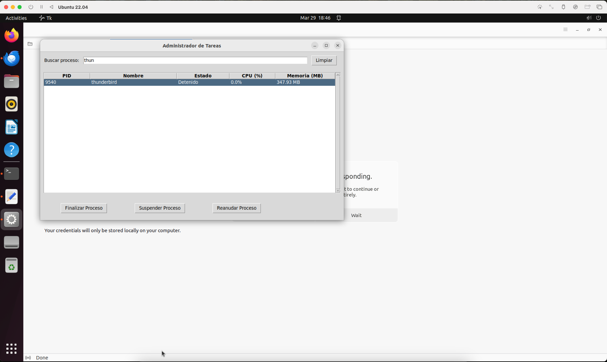
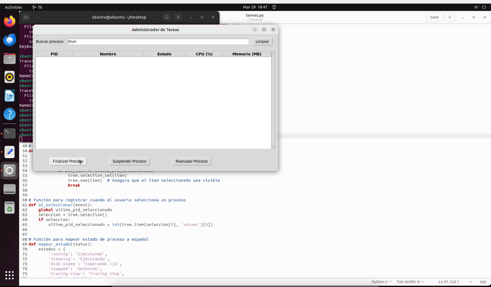

# Administrador de Tareas

## Grupo de estudiantes

- Luis Alvarado: 0900-20-7376
- Luis Ordoñez: 0900-19-9883
- Miguel Pineda: 0900-15-15258
- Diego Morales: 0900-22-1362

## Descripción

El objetivo de este proyecto es poder visualizar todos los procesos que están ejecución en el Sistema Operativo.

## Tecnología utilizada

Python 3.3.12

## Explicación del código

Se ejecuta  esta función cada 2 segundos:
```python
def actualizar_procesos():
    global todos_procesos, ultimo_pid_seleccionado
    todos_procesos = []

    # Guardar PID seleccionado antes de actualizar
    seleccion = tree.selection()
    if seleccion:
        ultimo_pid_seleccionado = int(tree.item(seleccion[0], 'values')[0])

    for proc in psutil.process_iter(attrs=['pid', 'name', 'cpu_percent', 'memory_info', 'status']):
        try:
            # Validar que memory_info no sea None
            memoria = proc.info['memory_info']
            memoria_usada = f"{memoria.rss / (1024 ** 2):.2f} MB" if memoria else "N/A"

            # Mapear estado del proceso a español
            estado = mapear_estado(proc.info['status'])

            # Guardar los datos del proceso
            todos_procesos.append({
                'pid': proc.info['pid'],
                'name': proc.info['name'],
                'cpu': f"{proc.info['cpu_percent']}%",
                'memory': memoria_usada,
                'status': estado
            })
        except (psutil.NoSuchProcess, psutil.AccessDenied, psutil.ZombieProcess):
            pass

    # Aplicar filtro actual
    aplicar_filtro()

    # Restaurar la selección después de actualizar
    restaurar_seleccion()

    ventana.after(2000, actualizar_procesos)  
```

Esto nos sirve como diccionario de los estados

```python
def mapear_estado(status):
    estados = {
        'running': 'Ejecutando',
        'sleeping': 'Durmiendo',
        'disk-sleep': 'Esperando I/O',
        'stopped': 'Detenido',
        'tracing-stop': 'Tracing Stop',
        'zombie': 'Zombie',
        'dead': 'Muerto',
        'wake-kill': 'Despertar-Kill',
        'waking': 'Despertando',
        'parked': 'Estacionado',
        'idle': 'Inactivo'
    }
    return estados.get(status, status)
```

Con esta función filtramos el proceso que queremos ver

```python
def aplicar_filtro(*args):
    # Limpiar árbol
    for item in tree.get_children():
        tree.delete(item)

    filtro = entrada_busqueda.get().lower()

    # Mostrar procesos que coincidan con el filtro
    for proc in todos_procesos:
        if (filtro in str(proc['pid']).lower() or
                filtro in proc['name'].lower()):
            tree.insert("", "end", values=(
                proc['pid'],
                proc['name'],
                proc['status'],
                proc['cpu'],
                proc['memory']
            ))
```

Estas funciones nos ayudan a finalizar, suspender o reanudar un proceso seleccionado

```python
def finalizar_proceso():
    seleccion = tree.selection()
    if seleccion:
        pid = int(tree.item(seleccion[0], 'values')[0])
        try:
            proc = psutil.Process(pid)
            proc.terminate()
        except (psutil.NoSuchProcess, psutil.AccessDenied) as e:
            print(f"No se pudo finalizar el proceso: {e}")


# Función para suspender un proceso
def suspender_proceso():
    seleccion = tree.selection()
    if seleccion:
        pid = int(tree.item(seleccion[0], 'values')[0])
        try:
            proc = psutil.Process(pid)
            proc.suspend()
        except (psutil.NoSuchProcess, psutil.AccessDenied) as e:
            print(f"No se pudo suspender el proceso: {e}")


# Función para reanudar un proceso
def reanudar_proceso():
    seleccion = tree.selection()
    if seleccion:
        pid = int(tree.item(seleccion[0], 'values')[0])
        try:
            proc = psutil.Process(pid)
            proc.resume()
        except (psutil.NoSuchProcess, psutil.AccessDenied) as e:
            print(f"No se pudo reanudar el proceso: {e}")
```

Este fragmento de código manipula y crea la interfaz de usuario

```python
# Crear la ventana principal
ventana = tk.Tk()
ventana.title("Administrador de Tareas")
ventana.geometry("900x500")  # Aumentado ancho para acomodar nueva columna

# Frame para búsqueda
frame_busqueda = tk.Frame(ventana)
frame_busqueda.pack(fill=tk.X, padx=10, pady=10)

tk.Label(frame_busqueda, text="Buscar proceso:").pack(side=tk.LEFT, padx=(0, 10))

# Variable para el campo de búsqueda
var_busqueda = tk.StringVar()
var_busqueda.trace("w", aplicar_filtro)  # Llamar a aplicar_filtro cuando cambie el valor

entrada_busqueda = tk.Entry(frame_busqueda, textvariable=var_busqueda, width=30)
entrada_busqueda.pack(side=tk.LEFT, fill=tk.X, expand=True)


# Botón para limpiar búsqueda
def limpiar_busqueda():
    entrada_busqueda.delete(0, tk.END)


boton_limpiar = tk.Button(frame_busqueda, text="Limpiar", command=limpiar_busqueda)
boton_limpiar.pack(side=tk.LEFT, padx=10)

# Frame principal para la lista de procesos con padding
frame_procesos = tk.Frame(ventana, padx=10, pady=10)
frame_procesos.pack(fill=tk.BOTH, expand=True)

# Crear un árbol para mostrar los procesos dentro del frame
columnas = ("PID", "Nombre", "Estado", "CPU (%)", "Memoria (MB)")
tree = ttk.Treeview(frame_procesos, columns=columnas, show="headings")
for col in columnas:
    tree.heading(col, text=col)
    tree.column(col, width=100)  # Ancho inicial de columnas

# Configurar tamaños relativos de columnas
tree.column("PID", width=80)
tree.column("Nombre", width=200)
tree.column("Estado", width=100)
tree.column("CPU (%)", width=80)
tree.column("Memoria (MB)", width=120)

# Vincular evento de selección
tree.bind("<<TreeviewSelect>>", al_seleccionar)

# Añadir scrollbar dentro del frame de procesos
scrollbar = ttk.Scrollbar(frame_procesos, orient="vertical", command=tree.yview)
tree.configure(yscrollcommand=scrollbar.set)

# Ubicar scrollbar y tree en el frame de procesos
scrollbar.pack(side=tk.RIGHT, fill=tk.Y)
tree.pack(side=tk.LEFT, fill=tk.BOTH, expand=True)

# Frame para botones debajo de la lista de procesos
frame_botones = tk.Frame(ventana)
frame_botones.pack(side=tk.BOTTOM, fill=tk.X, pady=20, padx=20)

# Botones centrados en la parte inferior
boton_finalizar = tk.Button(frame_botones, text="Finalizar Proceso", command=finalizar_proceso)
boton_finalizar.pack(side=tk.LEFT, padx=40)

boton_suspender = tk.Button(frame_botones, text="Suspender Proceso", command=suspender_proceso)
boton_suspender.pack(side=tk.LEFT, padx=40)

boton_reanudar = tk.Button(frame_botones, text="Reanudar Proceso", command=reanudar_proceso)
boton_reanudar.pack(side=tk.LEFT, padx=40)
```

## Pruebas de ejecución







